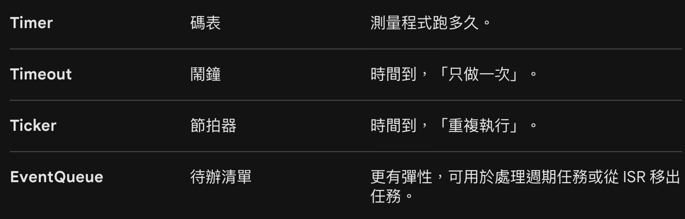

[控二](控二.md) 今天先重新再複習各個transfer function 所代表的物理意義以及模型 然後把$G(s)=C(sI-A)^{-1}B+D$ 做轉置會變成 $G(s)=B^T(sI-A^T)^{-1}C^T+D$ 如果原本是controll canonical form 轉置之後 對應到的就會是observer canonical from 然後可控矩陣$\mathcal{C}=[B\quad AB\quad A^2B \dots A^{n-1}B]$  不可控時就是有極零點對消 但及零點對蕭不一定不可控 因為狀態空間矩陣有無限多組 可能有些有對消有些沒有 然後極點離零點越近 或者 想把極點移更遠 K值都需要更大 也就是輸入要更大

>因為 $G(s)$ 在SISO是純量 所以$G(s)=G(s)^T$
>若原本系統為 $(A,B,C,D)$，其轉置系統為 $(A^T,C^T,B^T,D^T)$
>**不可控的幾何意義：** 代表 B,AB,… 這些向量全部落在同一個平面（或直線）上，它們沒辦法撐開整個 n 維空間。
>**工程直覺：** 如果 det(C) 越接近 0，代表系統「越難控制」。這時候 Ackermann 公式算出來的 K 就會變得異常巨大。

---
[嵌入實](嵌入實.md) 今天上課上lcd 反正就是用電壓控制偏光呈現RGB組成各種顏色 然後沒有通訊系統 所以要接一堆pin角 然後就一些規格 怎麼傳資料 設定模式 然後上pyside 是一個python套件 用來做一些小app 以後demo或做一些功能可以用 然後實驗做RTOS treads就是並行的一個程式 但底層也不是並行 只是快速切換 因為只有一個CPU 然後quene event就是把事件排程 想要執行在執行 然後中斷ISR不能有會需要時間執行的程式 所以需要時間執行的就放進排程 讓系統去跑 然後還有ticker 可以設定時間不斷重複 反正就一些fuction可以讓程式並行
