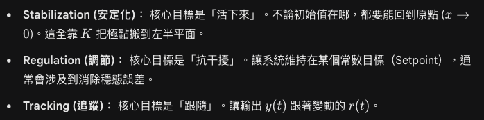
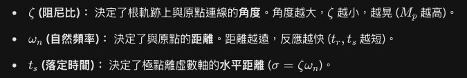

[控二](控二.md) 今天解釋可控性 可控性就是輸入u可以獨立控制每個狀態變數x的能力 都可以的話$rank(C)=n$ 然後舉一些例子 不一定要直接有u改變狀態變數 也可以間接用狀態變數改變狀態變數 但他們比例不能一樣必須線性獨立 或者不能相消 不然會耦合在一起 然後講stabization regulation 跟 tracking 前面選定K值全狀態回授就是stabization 可以讓系統的極點變成自己想要的樣子 讓系統的特性符合設計 regulation就是開始要設目標 假設系統是線性的 $y_{ss}=r,\ u_{ss}=N_{u}r,\ x_{ss}=N_{x}r$ 然後可以透過狀態空間解出$N_{u}, N_{x}$ 來看輸入跟輸出的關係 $y=(A-BK)x+(N_{u}+KN_{x})u$ 然後複習控一的二階系統 $M_{p},\ t_{s},\ t_{r},\ w_{n},\ \zeta$ 的意義、公式和在跟軌跡上分別是什麼 然後簡單介紹SLR跟LQR

>透過矩陣推導發現即使加了控制零點也不會改變
>如果是高階系統 其他零點和極點要放在主導極點的四五倍遠 這樣看起來就像二階系統

---
[外骨骼](外骨骼) 今天焊接encoder 買電池 藍牙模組

---
[[不對稱陷阱]] 其實有點看不懂 不知道是翻譯太爛還是作者太感覺流 但有幾個觀點 作者說其實那些極端發生的事情 後果應該要是負責的人要去承擔 但有些機制卻讓他把風險給轉嫁給別人 就像破產保護 或者一些銀行等等 然後人應該要有某些堅持 大於死亡的堅持 美德 等等 然後其實不是所有的東西都是像比較利益 都是追求金錢最大化 其實大部分人追求的就不是那些 