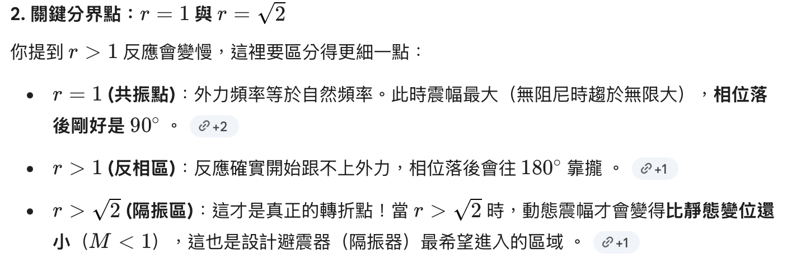
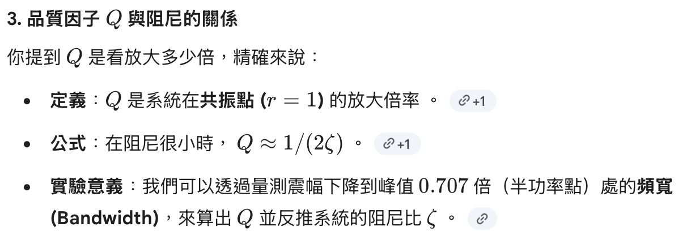

[振動學](振動學.md) 今天把課補一補 把阻尼補完 推廣到旋轉 然後第三章就在講弦波輸入 之前都是施加一個力而已 現在要持續施加 然後就會有暫態響應跟穩態響應 因為是LTI sys 所以steady state 就會是同樣頻率 不同振幅 有相位延遲或提前 基本上就是看$r=\frac{w}{w_{n}}$當$r>1$就是輸入頻率大於自然頻率 所以反應比推得慢 會沒有什麼動 然後相位延遲 反之 然後品質Q就是看放大多少倍 基本上就是輸入跟輸出的振幅比 然後就介紹無阻尼 阻尼大小不等的系統分別的公式

---
[製圖實作](製圖實作.md) 教塑膠件 基本上就像是一些程式的funtion 就是你一行一行其實做得出來 但是用這個函式就很方便