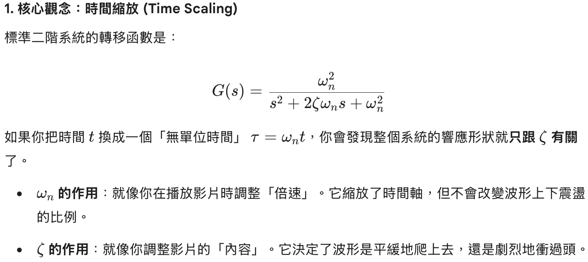

[look again](look%20again) 書提到慣性說謊和一些道德瑕疵有可能是因爲源自於小時候的謊言 因為大腦習慣了 屏蔽了說謊的不道德感 所以說謊變得沒有代價 就像任何事 任何選擇都是權衡 就像王習慣了偷搶 然後講到大家為什麼都這麼蠢 相信假訊息 因為重複就是力量 人們會傾向於相信重複出現的東西 簡單明顯的東西 因為當重複出現 就不會感到驚訝 會習慣 產生熟悉感 不管怎樣都會受到影響 人們並不是想要欺騙他人 而是分不清事實 跟我以前的體悟一樣 讓我更覺得資訊源真的太重要了 不要聽親戚亂說 不要看一些有的沒的 看書 篩選資訊來源 可能是最重要的事情 也講到社群媒體讓人把高標變成正常 把期望值調太高 導致變得不開心 相對剝奪感 也是因為大量接收而被洗腦 自己這一兩周關版也變的蠻舒服的 等哪天受不了再開 真的感覺社群媒體壞處一堆 然後改變可以帶來創造力 可能很適合自己跳來跳去

---
[控二](控二.md) 今天繼續完成作業三 複習控一有教的東西 $t_{p}=\frac{\pi}{w_{d}}$ 因為上升時間跟受響應的頻率有關 一個週期是$2\pi$當$t=\pi$時會達到第一個峰值$t=\pi=t_{p}$ 然後$\sigma=w_{n}\zeta$是實軸長度 $w_{d}=w_{n}\sqrt{ 1-\zeta^2 }$就是虛軸長度 $(-\sigma,\ \pm w_{d})$就是極點座標 整個就是$s^2+2\zeta w_{n}s+w_{n}^2$ 然後$M_{p}$跟$\zeta$有關 $w_{n}=\frac{1.8}{t_{r}}, \sigma=\frac{4.6}{t_{s}}=\frac{4.6}{W_{n}\zeta}$ 

---
[外骨骼](外骨骼) 今天買杜邦線接頭 然後買夾子 不太好夾 但是夾了幾個