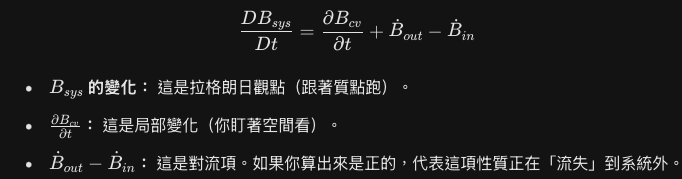

[熱流二](熱流二.md) 今天上 雷諾傳輸定理 (Reynolds Transport Theorem) 之前學科看系統基本上都是用CS系統角度 現在要以CV 體積去看然後因為流體會進進出出 雷諾傳遞函數就是說 體積裡面的物質量B的變化 會等於體積內的物質量變化 加上流進的物質量Bin減去流出的物質量Bout 熱流好像都把一個很簡單的觀念講得很複雜 可能是因為要嚴謹的推導或公式吧

>**系統性質的總變化率** = **控制體積 (CV) 內部的增減率** + **通過邊界 (CS) 的淨流出率**

---
[知識與實在](知識與實在) 沈思六 依然在唬爛