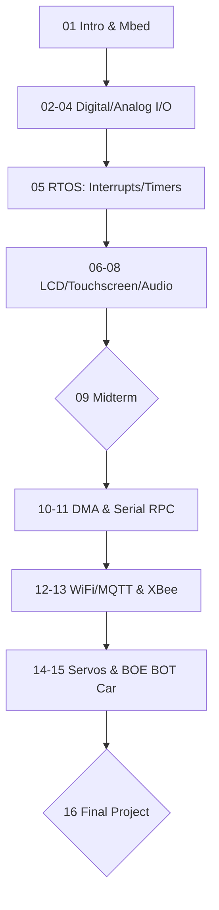

---
tags:
  - 嵌入式系統
  - 微控制器
  - IoT
  - Mbed
  - Cpp
aliases:
  - EE240500
  - 微控制器程式設計與應用
  - Embedded Systems Lab
date: 2026-03-30
type: subject
---

# 嵌入式系統實驗 (Embedded Systems Lab)

> [!abstract] 課程簡述
> 本課程專注於**微控制器 (Micro-controller)** 的程式設計與應用。使用 **ARM mbed** 函式庫與 **C/C++** 語言，在 **Cortex M4** 開發板上實作。課程涵蓋感測器、致動器、有線/無線通訊，最終目標是整合所有組件打造一台 **Boe Bot 機器小車**。

---

## 核心技術棧
*   **硬體平台**：ARM Cortex M4 Board (Boe Bot Car Platform)
*   **軟體環境**：ARM mbed OS / RTOS
*   **通訊協定**：UART, SPI, I2C, Serial RPC, MQTT (WiFi), XBee (Zigbee), BLE
*   **週邊控制**：GPIO, ADC, DAC, PWM (Servo), LCD, PING (Ultrasonic), DMA

---

## 教學進度與 Lab 規劃



---

## 考核方式

> [!info] 成績比重 (Evaluation)
> - **Labs & Helper Work**：14% (13% Labs + 1% Helper)
> - **Exams**：48% (共 3 次，每次 16%)
> - **Final Project**：30% (機器小車整合與展示)
> - **Participation**：8% (課堂參與與貢獻)

---

## 資源連結
*   **課程網站**：[LARC NTHU EE2405](http://www.larc-nthu.net//ee240500/)
*   **教科書**：*Fast and Effective Embedded Systems Design: Applying the ARM mbed* (2nd Ed)
*   **參考書**：*Embedded System Interfacing* by Marilyn Wolf (2019)

---
**相關連結：**
- [[數位邏輯設計]]
- [[微處理器原理]]
- [[物聯網導論]]
- [[C語言程式設計]]

## 歷程日誌 (Course Logs)

### [[2026-02-25]]
[[嵌入實]] 講課程資訊 當場做完 用實驗室電腦 講一些linux 計結 還有cli指令 不知道 感覺講超雜 然後廢話一堆 然後去電腦教室灌ubuntu輕輕鬆鬆 老熟了

### [[2026-03-04]]
[[嵌入實]] 今天上課上gpio digital i/o put然後繼續講上次沒說完的linux shell python語法
功耗很重要！
mbed是給你一些簡潔的function去呼叫HAL/LL去執行（使用 C++ 物件導向的方式來包裝硬體暫存器）
講解makefile CMake Ninja python3-venv...

### [[2026-03-12]]
[[嵌入實]] 把lab1用mac去跑 成功燒入

### [[2026-03-18]]
[[嵌入實]] 考第一次期中考 超難 根本在搞 直接破防 心態沒了 但助教很水 你跟他說有做 然後code講一下就行 作業要好好寫好好理解 然後把東西傳到github 之後要把作業跟考試做完訂正好 加油

### [[2026-03-19]]
[[嵌入實]] 今天把github用好 學到很多新東西 .gitignore可以決定不要上傳什麼 這樣裡面就可以保存其他repository 然後README.md用```code``` 可以把cli包在裡面 變成很好的tutorial

### [[2026-03-25]]
[[嵌入實]] 今天做lab4 發現自己都沒在看code 可能回家要複習一下 lab4是ADC的採樣 然後用py的
matplotlib畫圖 用py虛擬環境venv 然後lab5講解講thread RTOS ISR和matplotlib

>**Mbed 端（硬體）**：

- 使用 `AnalogIn` 讀取電壓（通常是 0.0 到 1.0 的浮點數）。
    
- **重點補完**：採樣頻率（Sampling Rate）非常重要。如果你在 `main.cpp` 用 `ThisThread::sleep_for(10ms)`，你的 Fs 就是 100Hz。
    
- 將數據透過 `printf` 噴到序列埠（Serial Port）。

>**Python 端（軟體）**：

- **虛擬環境 (`venv`)**：這是為了不讓不同專案的套件版本（如 `pyserial` 或 `matplotlib`）打架。在 Mac/Ubuntu 都要記得 `source venv/bin/activate`。
    
- **Matplotlib**：負責接收那 256 個點並畫出時域圖。
    
- **修正建議**：檢查你的 Python 代碼中 `Fs` 的設定，必須跟 Mbed 的採樣間隔完全對應，否則頻譜分析（FFT）算出來的頻率會是錯的。

>**什麼是 Thread（執行緒）？**

- **概念**：讓程式像是有「分身」。例如：`Main Thread` 負責運算，另一個 `Thread` 負責閃 LED。
    
- **關鍵優勢**：當 LED 執行緒在 `sleep` 時，CPU 會跳去執行運算執行緒，不會浪費任何一毫秒。
    

>**ISR (中斷服務常式) 的大禁忌**

- **絕對不能在 ISR 裡面做的事**：`printf()`、`malloc()` 或任何需要花時間的 `wait`。
    
- **原因**：中斷發生時 CPU 是處於「緊急模式」，如果在這裡卡住，整台機器會當掉。
    
- **解決方案**：使用 **EventQueue**。中斷觸發後，只丟一個訊息給 EventQueue，讓普通的 Thread 去慢慢執行 `printf`。

### [[2026-03-30]]
[[嵌入實]] 檢討第一次期中考
Everything is a file in Linux/Unix
Python 的索引是從 **0** 開始計算的 在 Python 中，負數索引代表 **「從後面數過來」**
當 Python 進行 `.1f` 格式化時，會根據小數點後第二位進行**四捨五入**
B-L4S5I-IOT01A 開發板CPU 核心：ARM® 32-bit Cortex®-M4
為什麼要用 ST HAL？
1. **Abstraction (抽象化)**：隱藏暫存器操作細節。
2. **Consistency (一致性)**：STM32 全系列通用。
3. **Efficiency (開發效率)**：提供現成的驅動程式與時脈配置。
Mbed OS 主要提供以下兩種模式來編譯與執行程式：
4. 裸機模式 (Bare-metal Mode)
5. RTOS 模式 (RTOS Mode / Multi-threaded Mode)
```Bash
chmod +x run.sh
chmod 700 run.sh
grep "image" file.txt
```

### [[2026-04-01]]
[[嵌入實]] 今天上課上lcd 反正就是用電壓控制偏光呈現RGB組成各種顏色 然後沒有通訊系統 所以要接一堆pin角 然後就一些規格 怎麼傳資料 設定模式 然後上pyside 是一個python套件 用來做一些小app 以後demo或做一些功能可以用 然後實驗做RTOS treads就是並行的一個程式 但底層也不是並行 只是快速切換 因為只有一個CPU 然後quene event就是把事件排程 想要執行在執行 然後中斷ISR不能有會需要時間執行的程式 所以需要時間執行的就放進排程 讓系統去跑 然後還有ticker 可以設定時間不斷重複 反正就一些fuction可以讓程式並行
![[assets/20260401/file-20260402205447690.png]]

### [[2026-04-08]]
[[嵌入實]] 今天教通訊系統 spi uart i2c 都是微處理機教過的 看書 看python 然後做lab 有點小躁 助教死不拿教材 我看錯題目還重接線 超低能

### [[2026-04-15]]
[[嵌入實]] 看一下HW2 考期中什麼都不會 殺了我行不行 耖

### [[2026-04-22]]
[[嵌入實]] 做完lab7 lab8

### [[2026-05-06]]
[[嵌入實]] 今天教wifi tcp/ip 跟 BLE 都是專題會用到的 認真看了一下 幹 結果這塊板子本身有imu和藍牙 耖 早知道直接用這塊不就好了 累到 然後做lab10 就是做ecp 反正就是遠端呼叫函式 感覺真的要好好學python

