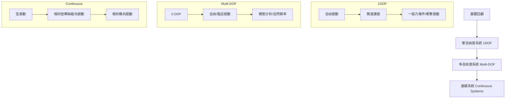

---tags:
  - 機械振動
  - 動態分析
  - 工程學
aliases:
  - PME 3320
  - 機械振動
  - Mechanical Vibrations
date: 2026-03-30
type: subject---

# 機械振動 (Mechanical Vibrations)

> [!info] 課程基本資訊
> - **課程代碼**：PME 3320
> - **授課教師**：李明晃 (Ming-Huang Li)
> - **關鍵字**：#Vibration #Damping #1DOF #Multi-DOF #Continuous-System

---

## 課程目標與先修

> [!abstract] 課程目標
> 旨在建立大學部學生對動態振動分析的基礎概念，涵蓋單自由度、多自由度系統的數學描述，以及桿件、樑等連續系統的振動分析。

> [!tip] 先修建議 (Prerequisites)
> 本課程強烈建議具備以下基礎：
> - [[動力學]] (Dynamics)
> - [[材料力學]] (Mechanics of Materials)
> - [[工程數學]] (Engineering Mathematics)

---

## 課程大綱 (Course Outline)

---

## 評分標準與規定

### 成績考核 (Grading)
- **作業與小考** (含電腦輔助作業)：30%
- **期中與期末考**：55%
- **動手實作與學期專題**：15%

### 注意事項 (Leave Policy)
> [!warning] 缺考與請假規定
> 1. 無正當理由缺考（含小考、期中、期末）**不予補考**或以其他分數替代。
> 2. **心理因素**不得作為期中與期末考之請假理由。

---

## 教學資源
- **指定用書**：
    - Singiresu S. Rao, *Mechanical Vibrations*, 6th Edition (SI Units), Pearson.
    - ISBN: 9781292178608

---
**相關連結：**
- [[動力學]]
- [[材料力學]]
- [[機動學]]
- [[自動控制]]

## 歷程日誌 (Course Logs)

### [[2026-03-06]]
[[振動學]] 這堂課數學很重 會用到很多工數 材料力學 應用力學等觀念 感覺很難 第一堂課就一堆推導 觀念感覺有聽懂 但是沒仔細看算式 振動學就是在教分析整個物體會如何作動 先把整體簡化成彈簧 質量 阻尼 然後看有多少自由度 一個一個分析之後再整個分析 重要的就是怎麼把它簡化成可以分析的形式 使得分析結果有效但又不會太複雜 要把它看成一兩個自由度還是有限單元分析

彈簧就是任何符合虎克定律$F = kx$的物體 並聯係數相加 串聯係數導數相加再倒數 就跟電阻電容等等相同概念 直觀 然後有線性的彈簧 不線性的 要做局部線性 任何形變的物體都可以當成彈簧
質量就是慣性 $F=ma$是指物體有多難被改變速度 推廣到旋轉的話就是慣性矩$M=J\ddot{\theta}$ 那個J就是旋轉世界的慣性
阻尼就是能量消耗器 有與速度成正比的 還有定值的 還有材料形變才有的阻尼
然後都有舉一堆例子跟算式只是沒認真看 幸好這些靠以前觀念還扛得住 但之後可能要認真聽或自己好好讀

 >將複雜的連續系統（無限多自由度）簡化為離散系統（少數幾個自由度），或是採用有限元素分析 (FEA) 來處理。
 >局部線性化 (Local Linearization)是利用泰勒級數展開 忽略高次項
 >阻尼力只有在兩端有「相對速度」時才會產生
 >求等效彈簧 $k_{eq}$：我們利用「位能守恆」或「力矩平衡」
 >求等效質量 $m_{eq}$：我們利用「動能等效」**$T = \frac{1}{2}m\dot{x}^2$ 或 $T = \frac{1}{2}J\dot{\theta}^2$

### [[2026-03-13]]
[[振動學]] 今天第一章最後上簡諧運動 簡諧運動就是在一個平衡點做來回擺盪 然後可以畫成一個圓 
位移 $A\sin{wt}$
速度 $wA\cos wt$（位移的微分）
加速度 $-w^2A\sin wt$（速度的微分）
然後可以寫成$Ae^{ iwt }$因為$\cos \theta+i\sin \theta$的泰勒展開式會等於$e^{ i\theta }$ 也就是尤拉公式

第二章上SDOF單自由度的系統 然後先講
質量和彈簧系統 $m\ddot{x}+kx = 0$ -> EOM of SHM 
力學能守恆 $T+U = const$
虛功原理 就是想像有反方向的力可以讓他靜力平衡 之後就會不做功 好像在講屁話 但可能推導公式有點用
然後轉動就把質量變成極質量慣性矩 (polar mass moment of inertia) $m\to J_{0}$ 
彈簧係數變成扭轉彈簧常數 (torsional spring constant) $k\to k_{t}$
EOM: $J_{0}\ddot{\theta s}+k_{t}\theta=0$
解題過程就是先畫FBD->EOM->solve EOM->帶入I.C.
$x(t)=Ae^{ iw_{n}t }=A_{1}\cos w_{n}t+A_{2}\sin w_{n}t$ 
$x(0)=x_{0}=A_{1}$, $\dot{x}(0)=\dot{x_{0}}=w_{n}A_{2}$ 令$A_{1}=A\cos \phi$, $A_{2}=A\sin \phi$
$A=(A_{1}^2+A_{2}^2)^\frac{1}{2}=[x_{0}^2+(\frac{\dot{x_{0}}}{w_{n}})^2]^\frac{1}{2}=amplitude$
$\phi=\arctan(\frac{A_{2}}{A_{1}})=\arctan(\frac{\dot{x_{0}}}{x_{0}w_{n}})=phase$ -> $x(t)=A\cos(w_{n}t-\phi)$

>達朗伯原理 (D'Alembert's Principle)：加上一個假想力$-m\ddot{x}$使得物體從動態變成靜態來分析
>虛功原理 (Principle of Virtual Displacements)：給處於力平衡的系統微小位移（虛位移$\delta x$）所有力對這個位移的做功會是零 因為力平衡
>垂直彈簧：$mg=k\delta _{st}\to w_{n}=\sqrt{ \frac{g}{\delta_{st}} }\because w_{n}=\sqrt{ \frac{k}{m} }$所以只要知道彈簧的靜態位移$\delta_{st}$就可以知道他的自然頻率
>瑞利能量法 (Rayleigh's Energy Method)：利用最大動能 = 最大位能$T_{max}=U_{max}$，把複雜的連續物體化簡成一個等效質量塊

### [[2026-03-20]]
[[振動學]] 今天上課沒在聽 在寫作業 看影片 自己讀 今天上有阻尼的系統 基本上就是推導阻尼比 然後控一都有上過 但是更清楚更詳細 阻尼比0-1是震盪（欠阻尼） 然後1是臨界屆尼（剛好不震盪） 大於一是過阻尼（不震盪）基本上都想要做到臨界阻尼 然後推導公式 這些都是跟速度成正比的阻尼 之後講定量的阻尼 在乾燥地方阻尼是定值 所以消耗的能量是固定的 震盪會停 不會回到中心點 

>$\zeta$ (Damping Ratio)
>黏滯阻尼系統 (Viscous Damping)：與速度成正比 $m\ddot{x}+c\dot{x}+kx=0$ 
>**阻尼自然頻率** $\omega_{d}=\omega_{n}\sqrt{ 1-\zeta^2 }$
>黏滯阻尼的震幅縮小是呈**「指數函數」** $e^{ -\zeta \omega_{n}t }$衰減的，理論上震動會持續到無限久，只是震幅變得無限小 。
>庫倫阻尼 (Coulomb Damping)：定量阻尼 (乾摩擦) $F=\mu N=\mu mg$
>**每個完整週期**震幅固定減少：$\Delta X=\frac{4\mu N}{k}$ **完全不會改變震動頻率**
>對數衰減率（Logarithmic Decrement, $\delta$）自由振動中，**相鄰兩個波峰振幅比值的自然對數** 可以反推算出系統的**阻尼比 (ζ)** 對於阻尼較小的系統，對數衰減率與阻尼比有簡單的線性關係$\delta \approx2\pi \zeta$

### [[2026-03-27]]
[[振動學]] 翹課

### [[2026-04-10]]
[[振動學]] 今天把課補一補 把阻尼補完 推廣到旋轉 然後第三章就在講弦波輸入 之前都是施加一個力而已 現在要持續施加 然後就會有暫態響應跟穩態響應 因為是LTI sys 所以steady state 就會是同樣頻率 不同振幅 有相位延遲或提前 基本上就是看$r=\frac{w}{w_{n}}$當$r>1$就是輸入頻率大於自然頻率 所以反應比推得慢 會沒有什麼動 然後相位延遲 反之 然後品質Q就是看放大多少倍 基本上就是輸入跟輸出的振幅比 然後就介紹無阻尼 阻尼大小不等的系統分別的公式
![[assets/20260410/file-20260410133124074.png|697]]
![[assets/20260410/file-20260410133215868.png]]

