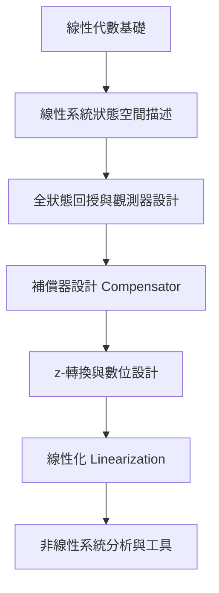

---
tags:
  - 控制系統
  - 自動控制
  - 狀態空間
  - 數位控制
aliases:
  - Control Systems II
  - 進階自動控制
date: 2026-03-30
type: subject
---

# 控制系統 (二) (Control Systems II)

> [!abstract] 課程簡述
> 本課程為 [[控制系統(一)]] 的進階延伸，重點在於**狀態空間設計 (State-space Design)**、**數位控制 (Digital Control)** 以及 **非線性系統 (Nonlinear Systems)**。
> 
> *   **狀態空間**：從線性代數基礎出發，涵蓋全狀態回授、觀測器 (Estimator) 與動態補償器設計。
> *   **數位控制**：引入 z-轉換，學習數位等效控制器設計。
> *   **非線性系統**：介紹線性化與基礎非線性分析工具。

---

## 學習地圖 (Syllabus)



---

## 教學資源與先修

> [!info] 先修建議 (Prerequisites)
> - [[工程數學]]
> - [[控制系統(一)]]

> [!book] 指定用書 (Textbook)
> - **Franklin, G. F., et al. (2015)**. *Feedback Control of Dynamic Systems*, 7th Ed, Prentice Hall.

> [!cite] 參考書籍 (References)
> 1. Golnaraghi & Kuo. *Automatic Control Systems*, 9th Ed.
> 2. Norman S. Nise. *Control Systems Engineering*, 6th Ed.

---

## 考核方式

| 項目 | 比重 |
| :--- | :--- |
| **作業 (Homework)** | 30% |
| **期中考 (Midterms)** | 30% |
| **期末考 (Final Exam)** | 30% |
| **實驗作業 (Lab Assignments)** | 10% |

---
**相關連結：**
- [[控制系統(一)]]
- [[工程數學]]
- [[動態系統建模]]
- [[機器人學]]

## 歷程日誌 (Course Logs)

### [[2026-02-24]]
[[控二]]有小專題 三個人一組 有作業但不用交 段考5,60%考作業 演習課週三晚上 去不了 前面先複習線性代數 把矩陣比喻成函數 真的很扯 不虧是葉廷仁 很到位 如壺灌頂  直行column 橫列row

### [[2026-02-25]]
[[控二]] 繼續複習線代 
矩陣就是對向量作用的函數 可以做映射 投影 縮小放大 旋轉等等操作 也可以從三維空間映射到二維 
向量其實就是多組變數 然後矩陣就是讓多組變數互相影響然後變成新的一組變數 
就或許就是為什麼控二是在處理MIMO的現代控制系統 
然後講了向量空間 對加法和實數乘法有封閉性 
線性獨立 基本上就是其他向量的線性組合不能有自己 反之則線性相依
行空間 就是把矩陣的航線性組合得到的空間 應該是多少組向量是線性獨立就多少維度

> Ax其實就是對A的行向量做線性組合
> Ax=b particular solution 行空間 row space
> Ax=0 homogeneous solution 零空間 null space
> 兩個維度加起來會是總行數

### [[2026-03-03]]
[[控二]] 今天複習上週教的東西 然後教得更完整 教了rank 然後學習怎麼判斷行空間和零空間 基本上就是看有幾個線性獨立 幾個是相依的 然後後面介紹方陣 如果不是奇異矩陣 full rank的話就可以直接x=A^-1 b直接求出唯一解 然後如果是無解或無限多組解 就是用最佳化求出最符合目標的解 然後介紹單位矩陣 上三角 下三角 對稱等等的特殊方陣 每個都有它的性質要記

>正定 座標轉換 null + rank = n

### [[2026-03-04]]
[[控二]] 今天上課上特徵值和特徵向量 對於方陣來說 會找到一些特徵值使得 $\det(A-\lambda I) = 0$搭配特徵向量$\mathbf{x} \neq 0$ 會得到$(A-\lambda I)\mathbf{x} = 0$ 有無限多組解 $A\mathbf{x} = \lambda x$ 
可以透過$\det(A-\lambda I) = 0$取得特徵方程式解出$\lambda$
奇異方陣：行列式值為零 特徵值為零 rank不滿 Ax=b有無限多組解或無解...
最後講到C-H theorem 可以把特徵方程式的$\lambda$用A矩陣替代解出A的冪次方和sin(A)...

### [[2026-03-10]]
[[控二]] 今天教狀態空間 一開始補充什麼是相似矩陣 就是做相同映射但是不同基底的矩陣 然後上狀態空間 一開始完全聽不懂 但其實概念蠻簡單的 就是找狀態變數x然後要用其他狀態變數和輸入u的線性組合去表達他的微分$\dot{x}$ 寫成矩陣型態 也就是他下一秒會在哪 會是多少 然後輸出y也用狀態變數和輸入的線性組合去表達 一樣用矩陣方式表達 狀態變數 輸入 輸出 都可以是很多個 寫成向量就好 然後有設定狀態變數的tips 質量找速度 彈簧找變形量 電容找電壓 電感找電流 然後舉了一些例子怎麼把系統寫成狀態空間 好處就是可以處理MIMO 可以有幾何映射 還有串接其他運算？

### [[2026-03-11]]
[[控二]] 今天繼續上狀態空間 複習一下昨天的 把揚聲器講的更詳細 然後提到馬達 電動機械 機電磁 然後講最簡單彈簧阻尼質量 最簡單的例子 反正就二階系統 其實很簡單 $m\ddot{x}=F-b\dot{x}-kx$ 然後一個一個分析 如果拉氏轉換耦合需要解聯立方程式

### [[2026-03-11]]
[[外骨骼]] 今天用mbed用還是量不到 確定是硬體被設定成只有角度 下午上完控二問學姊 然後晚上問學長發現可以直接接線跑軟體 但還是沒測到

### [[2026-03-17]]
[[控二]] 今天在複習馬達 基本上輸入都是電壓 會輸入電流是因為有電流回授 有自動控制才做得到 就想水流一樣 控制水壓簡單 控制水流難 然後電壓控制轉速是一階系統 控制角度是二階 有幾次微分 學習如何看到轉移函數就知道他的物理意義 以後看到一階就要想到馬達 然後複習時間常數 DC gain 等等 然後教方塊圖 基本上就是三種op（積分器/加法器/放大器）去組成 從微分方程要變成方塊圖就是等號左邊留最高相次微分項 其他移到右邊 然後開始寫 積分器 然後教如何變成狀態空間 基本上就是把積分器後面的東西當作狀態變數 然後好好思考$\dot{x}=Ax+Bu$, $y=Cx+Du$ 的$A,B,C,D$矩陣分別是什麼 在微分方程跟轉移函數還有狀態空間中轉換 就只是不同表達式而已 但轉移函數跟微分方程是一對一 對狀態空間和方塊圖則否 是一的對多 今天教 controll canonical form跟 modal canonical form

>控制典型形式 (Control Canonical Form, CCF)：轉移函數分母的多項式係數，會直接（加上負號後）填入系統矩陣 Ac​ 的第一列或最後一列；而 Bc​ 矩陣通常只有一個元素是 1，其他都是 0。
>模態典型形式 (Modal Canonical Form)：Am​ 會是一個**對角矩陣 (Diagonal Matrix)**，而且對角線上的數值，正好就是系統的**特徵值（也就是轉移函數的極點）**這種形式可以把系統完全「解耦 (Decoupled)」。你可以一眼看出系統有幾個模態、誰負責震盪、誰負責衰減，彼此互不干擾。

### [[2026-03-18]]
[[控二]] 一開始教如何判別受控體的轉移函數$G(s)$ $\mathcal{L}^-1\{G(s)\}=g(t)$也就是impulse respond 所以給impulse就可以得到轉移函數 但是沒有完美的impulse且物理系統也承受不住impulse所以改用step 給sin播也可以得到bode plot 後來教狀態空間轉換 從canonical form轉到 modal form 其實就是把$A$矩陣做對角化 就像座標轉換一樣 他其實對應到的是一樣的 所以$A$是相似矩陣 然後教如何把一般的狀態空間變成canonical form 反正超麻煩 就要解一堆方程式

>轉換矩陣$T$由系統矩陣 A 的**特徵向量 (Eigenvectors)** 所組成的

### [[2026-03-24]]
[[控二]] 今天複習上週教的如何從control canonical form變成modal form然後教如何從一般state space變成control canonical form和modal form 把$A$矩陣對角化$A=V\Lambda V^{-1}$ 就會變成modal form 狀態裝換 "tf2ss"有兩種方式 一種是物理建模 狀態變數有物理意義 另一種是方塊圖 狀態變數就是純數學 control canonical form很好用因為特徵方程式好求 行列式值也好求 用controllability matrix $\mathcal{C}$來判斷可控性 必須是可逆 狀態轉換不影響可控性 因為矩陣相乘的行列式等於矩陣的行列式執相乘$\mathcal{C_{z}}=T^{-1}\mathcal{C_{x}}$ 當$\det\mathcal({C_{x}})\neq_{}0$時 $\det\mathcal({C_{z}})\neq_{}0$ 因為$\det T\neq_{}0$ observer canonical form先不教 然後上狀態空間第二章 "ss2tf" 從狀態空間變成轉移函數 其實可以有MIMO $G(s)$是TFM 但是這門課只看SISO 其實就是把狀態空間做拉普拉斯轉換 然後就可以求得$X(s)=(sI-A)^{-1}BU(s)+(sI-A)^{-1}x(0)$就是force response加nature response 然後把$X(s)$代入$Y(s)$就會得到$G(s)$跟$X(s)$無關 因為轉移函數是從輸入到輸出的函數 跟狀態無關 及零點對消會變的的不可控

>系統輸出$Y(s)$的完整形式包含兩部分 ：
>**Forced Response（受迫響應）：** $C(sI-A)^{-1}BU(S)$，與輸入 u 有關 。
>**Natural Response（自然響應）：**$C(sI-A)^{-1}x(0)$，與初始狀態有關 。
>轉移函數 G(s) 被定義為「**初始條件為零**」時，輸出對輸入的比值 ：$G(s)=\frac{Y(s)}{U(S)}=C(sI-A)^{-1}B+D$
>A 的特徵值就是極點觀察 $G(s)$ 的公式，分母包含了 $det(sI−A)$，在線性代數中，讓 $det(sI−A)=0$ 的根 s 就是矩陣 A 的**特徵值 (Eigenvalues)**，因此，系統的**自然頻率（極點）**完全由系統矩陣 A 決定，這就是為什麼特徵值分析在控制中如此重要 。
>若假設系統以某個頻率 $pi$​ 運動，即 $x(t)=e^{ pi​t }x(0)$​ 。代入微分方程式會發現這本質上就是求 $(pi​I−A)x(0)​=0$ **物理意義：** 如果初始狀態 x0​ 剛好落在 A 的某個**特徵向量**方向上，系統的反應就會單純呈現出該特徵值對應的模態（例如單純的衰減或單純的震盪）。

### [[2026-03-25]]
[[控二]] 今天複習昨天教的 $x(t)=e^{ At }\ast Bu(t)+e^{ At }x(0)$ 然後教怎麼解 $e^{ At }$ 有三種方法：第一是透過power series 第二種是透過C-H theorem 第三種是透過對角化 $A=V\Lambda V^{-1}$ 然後複習nature response $X(t)=\Sigma c_{i}e^{ \lambda i }vi$ 因為x(0)一定是eigen vector的線性組合 被$A$做線性轉換時 只會放大縮小 最後講$G(s)$用弦波去做頻率響應 101的避震器就是設計避震器被動把極點消掉 控制就是主動把極點消掉 極點是共振 零點是不反應 但會有水床效應 但是我們要的是避免共振讓大樓倒 $\det(sI-A)=0$ 表示$A$的特徵方程式 解是eigen value $A\sin(wt)\to \boxed{G(s)}\to |{G(jw)}|A\sin(wt+\angle G(jw))$ 

>**Power Series (冪級數)：** 最原始定義$，e^{ At }=I+At+\frac{(At)^2​}{2!}+…$
>**C-H Theorem (凱萊-哈密頓定理)：** 利用 $A$ 滿足其特徵多項式，將無限級數簡化為 n−1 次的多項式 。**對角化 (Diagonalization)：** 當 $A$ 有 n 個線性獨立特徵向量時，$e^{ At }=Ve^{ \Lambda t }V^{−1}$，其中 $e^{ \Lambda t }$ 只是對角線上 $e^{ \lambda_{i} }$ 的簡單縮放。
>**被動控制：** 調諧質量阻尼器 (TMD) 本質上是增加一個新的自由度，藉此在受控體（大樓）的**共振頻率（即極點所在的虛數軸位置）**附近產生一個**零點**，用來抵銷共振。
>**主動控制：** 則是透過全狀態回授 u=−Kx，直接改變 A 矩陣，把極點從靠近虛數軸（易共振）的地方「拔走」，移到左半平面深處 。

### [[2026-03-31]]
[[控二]] 今天教控制 控制系統就是要控制系統的極點 透過回授 全狀態回授$\dot{x}=Ax+Bu, u=-Kx\to \dot{x}=(A-BK)x$ 就是把u變成x的線性組合 但是必須要觀察到所有的x不然就要用預測的 然後有三種方法可以解出k 第一種就是直接代入K然後看我們想要的特徵方程式是什麼解出K 第二種是用control canonical form然後把A, B矩陣合在一起 寫出特徵多項式 一樣用我們所要的極點求出K 透過這種方式就可以安置極點 從開回路極點到閉回路極點 如果不是control canonical form就透過狀態轉換變成control canonical form 然後第三種就是公式解 用ackermann's formula 老師沒細講

>利用 **Control Canonical Form (CCF)** 的特殊結構，因為在 CCF 形式下，系統矩陣 Ac​ 的第一列（或最後一列）直接就是特徵多項式的係數。
>matlab模擬不僅要畫出x, y也要畫出u看有沒有超過物理限制
>求解 K 的三種招式：
1. 直接代入法 (Direct Substitution)
- **作法：** 直接計算 det[sI−(A−BK)]=0，得到一個含有未知數 Ki​ 的多項式。
- **對比：** 將其與理想的多項式 (s−s1​)(s−s2​)⋯=0 對比係數。
- **適用：** 只適合 2×2 的簡單系統，階數一高，行列式會算到哭。

2. 轉換至控制典型形式 (Transformation to CCF)
- **步驟：**
    1. 找出轉換矩陣 T（利用可控制矩陣 C）。
    2. 在 CCF 下直接看圖說故事，求出 $k_{ccf}$。
    3. **重要：** 最後要把得到的 Kccf​ 轉回原本的座標系：$K=K_{ccf}T^{-1}$。

3. Ackermann 公式 (Ackermann's Formula)

### [[2026-04-01]]
[[控二]] 今天先重新再複習各個transfer function 所代表的物理意義以及模型 然後把$G(s)=C(sI-A)^{-1}B+D$ 做轉置會變成 $G(s)=B^T(sI-A^T)^{-1}C^T+D$ 如果原本是controll canonical form 轉置之後 對應到的就會是observer canonical from 然後可控矩陣$\mathcal{C}=[B\quad AB\quad A^2B \dots A^{n-1}B]$  不可控時就是有極零點對消 但及零點對蕭不一定不可控 因為狀態空間矩陣有無限多組 可能有些有對消有些沒有 然後極點離零點越近 或者 想把極點移更遠 K值都需要更大 也就是輸入要更大

>因為 $G(s)$ 在SISO是純量 所以$G(s)=G(s)^T$
>若原本系統為 $(A,B,C,D)$，其轉置系統為 $(A^T,C^T,B^T,D^T)$
>**不可控的幾何意義：** 代表 B,AB,… 這些向量全部落在同一個平面（或直線）上，它們沒辦法撐開整個 n 維空間。
>**工程直覺：** 如果 det(C) 越接近 0，代表系統「越難控制」。這時候 Ackermann 公式算出來的 K 就會變得異常巨大。

### [[2026-04-07]]
[[控二]] 今天解釋可控性 可控性就是輸入u可以獨立控制每個狀態變數x的能力 都可以的話$rank(C)=n$ 然後舉一些例子 不一定要直接有u改變狀態變數 也可以間接用狀態變數改變狀態變數 但他們比例不能一樣必須線性獨立 或者不能相消 不然會耦合在一起 然後講stabization regulation 跟 tracking 前面選定K值全狀態回授就是stabization 可以讓系統的極點變成自己想要的樣子 讓系統的特性符合設計 regulation就是開始要設目標 假設系統是線性的 $y_{ss}=r,\ u_{ss}=N_{u}r,\ x_{ss}=N_{x}r$ 然後可以透過狀態空間解出$N_{u}, N_{x}$ 來看輸入跟輸出的關係 $y=(A-BK)x+(N_{u}+KN_{x})u$ 然後複習控一的二階系統 $M_{p},\ t_{s},\ t_{r},\ w_{n},\ \zeta$ 的意義、公式和在跟軌跡上分別是什麼 然後簡單介紹SLR跟LQR

>透過矩陣推導發現即使加了控制零點也不會改變
>如果是高階系統 其他零點和極點要放在主導極點的四五倍遠 這樣看起來就像二階系統![[assets/20260407/file-20260407223222326.png]]![[assets/20260407/file-20260407223251927.png]]

### [[2026-04-08]]
[[控二]] 今天複習昨天教的 穩定 調節 然後二階系統 還有系統型別 控一是用回受 較穩健 控二是用前饋 但對系統參數很敏感 然後介紹LQR 基本上就是在輸入跟性能做權衡 $J= \int_{{0}}^{\infty}\rho z(t)^2+u(t)^2$ 就像其他東西一樣 你不能既要又要且要 高興能就必須要高輸出 想要成績高就要努力讀書 像我可能就選擇稍微讀書過就好 根據不同人 不同個性 不同產品 需要設計不同的功能 也就像昨天讀的[[不對稱陷阱]] 切膚之痛 你必須為你所做的事承擔風險

### [[2026-04-11]]
[[控二]] 寫作業二和三 寫一寫對答案 然後看一下應該要怎麼算

### [[2026-04-13]]
[[控二]] 寫控二HW3 發現自己矩陣很爛 根本不太知道怎麼算 然後觀念不是很好 所以去看3Blue1Brown 補線代

### [[2026-04-14]]
[[控二]] 今天繼續完成作業三 複習控一有教的東西 $t_{p}=\frac{\pi}{w_{d}}$ 因為上升時間跟受響應的頻率有關 一個週期是$2\pi$當$t=\pi$時會達到第一個峰值$t=\pi=t_{p}$ 然後$\sigma=w_{n}\zeta$是實軸長度 $w_{d}=w_{n}\sqrt{ 1-\zeta^2 }$就是虛軸長度 $(-\sigma,\ \pm w_{d})$就是極點座標 整個就是$s^2+2\zeta w_{n}s+w_{n}^2$ 然後$M_{p}$跟$\zeta$有關 $w_{n}=\frac{1.8}{t_{r}}, \sigma=\frac{4.6}{t_{s}}=\frac{4.6}{W_{n}\zeta}$ 
![[assets/20260414/file-20260414104602555.png]]

### [[2026-04-15]]
[[控二]] 今天檢討昨天期中考 有點涼 但還行吧 自己運算真的很爛 線代也是 真的要補一下 但觀念是還行

### [[2026-04-21]]
[[控二]] 控一是透過輸出當回授 控二是透過狀態進行回授 但全狀態回授太麻煩和昂貴了每個狀態都需要相對應的感測器 所以要用輸出去做估測來取的狀態 然後LQR $\rho\to \infty,\ \rho\to 0$ 分別是cheap control problem 和 expensive control problem 基本上就是沒控制或者控到底 啊看控制需不需要花錢 沒控制極點就不會變 控到底極點就會變到零點或漸近線 就像控一的跟軌跡一樣 LQR: Linear Quadratic Regulater $1+\rho G_{0}(-s)G_{0}(s)=0, G_{0}(s)=\frac{Z}{U}=C(sI-A)^{-1}B$

```matlab
k = lqr(A, B, Q, R)
```

### [[2026-04-22]]
[[控二]] 做極點擺置有兩種方法 第一就是把它看成二階主導 透過要求的$M_{p},\ t_{s},\ t_{r}$來決定閉回路極點 但是高階系統就要把其他極點放置在四五倍遠的實軸才會二階主導 使得增益K要很大 所以我們可以透過最佳控制 也就是LQR對稱跟軌跡 透過$\rho$的數值去找到最佳的極點 但是要透過全狀態回授才能改變極點 有可能感測器太貴 不能裝 又或是狀態變數並不是可以觀測的物理量 是純數學 所以沒辦法觀測 所以要用y去estimate狀態變數x去做全狀態回授 開回路估測會有誤差 誤差跟A矩陣有關 也就是跟系統的自然響應有關

### [[2026-04-28]]
[[控二]] 今天教閉回路的估測器 就是把y加進來 變成誤差跟$A-LC$有關 基本上就跟$A-BK$一模一樣 只是順序相反 所以就取轉置 就好了 就一樣了 就是對偶性 跟電路的戴維寧和諾頓一樣 然後就一樣有可觀性 oberver canonical form 就是一一對照可控矩陣就行了 然後講到濾波

### [[2026-05-05]]
[[控二]] 今天講把整個控二要教的東西串在一起 從可控矩陣開始 全狀態回授 如何找K 如何放置極點 用二階主導或者SRL 因為沒辦法讀到所有狀態 所以用輸出推導出狀態 就到可觀矩陣 找到L 如何放置極點 L用干擾跟雜訊的比例決定 然後就形成一個必回路 從u到y 再從y到u 回授 然後證明受控場的極點跟控制器的極點連在一起之後會他們的聯集 也就是為什麼我們可以分開來看可控跟可觀 然後有極零點對消 就會有不可觀或者不可控的存在 整個就形成一個補償器

### [[2026-05-06]]
[[控二]] 今天教control canonical form另一種形式 基本上就是把它順序顛倒而已 然後講L怎麼找 就是因為要收斂的比受控場還快 受控場才有用 所以極點要在受控場極點的四五倍遠

### [[2026-05-12]]
[[控二]] 今天複習上週的東西 然後講控二的侷限 就是轉移函數 $A,\ B,\ C$ 矩陣很難求得  但是可以當作一個模板 再用控一去微調 波得圖要符合：(1)低頻夠高 (2)高頻夠低 (3)crossover 夠大 (4)phase margin 夠大 且控二可以有最佳化 然後要講regulator一直沒講到 明天會講

### [[2026-05-22]]
[[控二]] 所有都建立好之後 受控場 全狀態回授 估測器 找到$K,\ L$就是一個stability 之後就是要做regulation 加入輸入r 然後在受控場和估測器中加入$M,\ \bar{N}$ 有三種方式可以選定$M,\ \bar{N}$第一種就是autonomous estimator 讓$M=B\bar{N}$使得輸入r不參與（影響）狀態估測 $\bar{N}$用之前教的方法求的 $M$就也求得了 然後第二種是tracking error estimator就是只需要誤差e當作估測器輸入就好了 不需要y和r 在不知道y和r只知道e的時候很好用 $\bar{N}=0,\ M=L$ 第三種就是萬用的也包括前兩種 zero-assignment顧名思義也就是極點放置 受控場的零點不能透過回授改變 所以會存在 但還有一部份的零點就是估測器零點n階 然後整個閉迴路系統（State + Estimator）的總維度是2n階 因為根據分離定理 極點是$eigen(A-BK)\cup eigen(A-LC)$所以當極點小於2n階就是有發生及零點對消 小於n階就是有發生跟受控場零點對消 然後第三種方法就是可以透過$\bar{M}=\frac{M}{\bar{N}}$來放置估測器的零點 來達成想要的效能 受控場如果有不穩定（右半平面的零點）不能消 因為沒消乾淨會裂開 然後做控制要的就是快穩準 在意$t_{s},\ t_{r},\ M_{p},\ e_{ss}$ 然後控二到這裡為什麼沒有穩態誤差都是因為有$\bar{N}$來做前饋 而不是回授 但前饋對於系統模型很敏感且不穩健 所以接下來要介紹積分器 也是就把e做積分來當作積分器

> **擴增狀態空間系統（Augmented System）**：是將「誤差的積分」$\int e\ d\tau$作為一個新的狀態變數併入原系統中
> unity DC gain：介紹如何透過計算特定的 $\bar{N}$ 增益，使整體封閉迴路系統的直流增益（DC Gain）等於 1，以達到消除步階命令穩態誤差的目的 。

### [[2026-05-26]]
[[控二]] 複習上次講的 就是把誤差積分當作新的變數$x_{I}=\int_{t}e\ d\tau$然後變成函數$z=[x_{1}, x_{2}, x_{I}]$ 然後就跟之前一模一樣去做運算 然後講到線性化 控一控二探討的都是線性系統 但現實世界都是非線性的 所以要做線性化 也就是以微小來看非線性系統會近似成一直線 操作就是先找到平衡點 然後做泰勒展開 只取第一項 就會變成線性 $A,\ B,$矩陣會是jacobian

