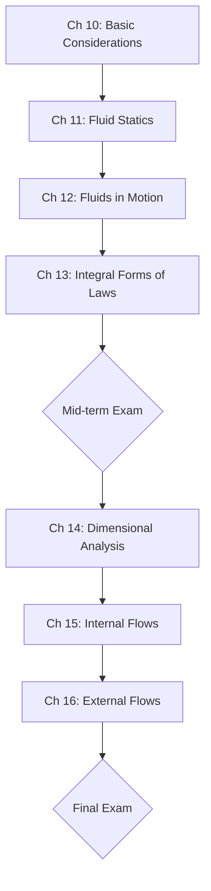

---tags:
  - 熱流科學
  - 流體力學
  - 工程學
aliases:
  - Thermal and Fluid Science II
  - 流體力學基礎
date: 2026-03-30
type: subject---

# 熱流科學 (二) (Thermal and Fluid Science II)

> [!abstract] 課程簡述
> 本課程為熱流科學系列（I & II）的第二部分，重點在於**流體力學 (Fluid Mechanics)**。
> 
> *   **授課語言**：陳玉彬教授之課程主要以英文授課 (> 60%)。
> *   **核心關鍵字**：#流體力學、#層流、#紊流、#邊界層、#壓力。

---

## 課程進度 (Syllabus)

---

## 教學資源

> [!book] 指定用書 (Textbook)
> *   **Potter, M. C. & Scott, E. P. (2004)**. *Thermal Sciences: An Introduction to Thermodynamics, Fluid Mechanics and Heat Transfer*.

> [!cite] 參考書籍 (References)
> 1. Truns, S.R. (2006). *Thermal-Fluid Science*.
> 2. Cengel, Y.A., et al. (2012). *Fundamentals of Thermal-Fluid Sciences* (4th ed.).

---

## 考核方式

> [!info] 成績比重 (Evaluation)
> - **小考 (Quizzes)**：30% (預計 5 次)
> - **期中考 (Midterm Exam)**：35%
> - **期末考 (Final Exam)**：35%
> 
> **教學方式**：課堂講授 (Lectures) 與 筆試 (Written Exams)。

---
**相關連結：**
- [[熱流科學(一)]]
- [[工程數學]]
- [[熱力學]]
- [[熱傳學]]

## 歷程日誌 (Course Logs)

### [[2026-02-23]]
[[熱流二]] 老師講解規則 今年沒有水火箭 不點名 賺爛 期中期末一樣開書考 要買課本 跟蔡買 小考段考給考古 通常考課本例題相關

### [[2026-02-26]]
[[熱流二]]  講什麼是流體 流體的定義就是受到剪應力會有持續不斷的形變 但固體只會有一次形變 然後要怎麼判斷是不是可以用流體力學來看 就是平均自由徑Mean Free Path要跟你物體的尺寸比要小於1/10 所以在高空跟奈米級可能就不適用 要用稀薄來看 希伯來文

### [[2026-03-02]]
[[熱流二]] 今天講物理量 工程都是需要有規定的單位還有計算量 才能計算 介紹FTL/MTL系統 還有最基礎的一些物理量 然後可以推導出其他的 然後還有公制英制BG EE

### [[2026-03-05]]
[[熱流二]] 今天上課上了specific weight跟specific gravity scale of temperature and press然後詳細解粘滯性跟可壓縮性 黏滯性就是讓分子跟壁之間沒有相對移動無滑移條件 (No-slip condition)越高越不容易移動 可壓縮性就是在講壓力造成的體積壓縮多寡 然後非牛頓流體應該是在說受力跟形變不成比例 受力越大 形變反而越小 還是剪切力？

> idea gas value 
> **黏滯係數 (μ)** 越高，代表流體內部的**抗剪能力**越強。你可以想像成流體層與層之間的「摩擦力」越大，所以越難流動。
> **體積彈性模數 (Bulk Modulus, Ev​)**$$E_v = - \frac{dp}{dV / V} = \frac{dp}{d\rho / \rho}$$
> **牛頓流體：** 剪應力 (τ) 與剪切速率（變形速率 du/dy）成**線性正比**。公式：τ=μ(du/dy)。
> **非牛頓流體：** 兩者**不成線性比例**。它分為幾種情況：
> **剪切稀化 (Shear-thinning / Pseudoplastic)：** 受力（剪切）越快，變得越「稀」、越好流動（例如油漆、血漿、番茄醬）。
> **剪切增稠 (Shear-thickening / Dilatant)：** 受力越快，變得越「黏」、越硬。這就是你說的「受力越大形變越困難」（例如太白粉水）。
> 流體討論的是「變形**速率**」而非「形變量」。
> **Kinematic Viscosity (ν)**：動黏滯度 ν=μ/ρ

### [[2026-03-09]]
[[熱流二]] 今天小考 考理想氣體方程式 度R就是K凱氏溫標換算過去 度F華氏溫度的絕對零度 記得要多加32 然後bar=100kpsi

### [[2026-03-16]]
[[熱流二]] 今天複習粘滯性 黏滯性就是一個流動分子對周圍的影響有多少 越高影響越大 越容易帶動或拖緩 然後上可壓縮性$E_{v}=-\frac{dp}{\frac{dv}{v}}=\frac{dp}{\frac{d\rho}{\rho}}$就是壓力對體積的影響有多大 液體基本上視為不可壓縮 氣體在100m/s以下也是為不可壓縮 所以這堂課基本上就是都看作不可壓縮 然後講到線力 面力 和體積力 在微觀世界中線力>面力>體積力 因為體積力成三次方衰減 面力二次方 線力一次方 在據關中則反之 然後講到表面張力 就是一種線力 每個分子之間都有吸引力 在裡面的分子受四面八方來的力所以淨力等於零 但在表面的就會有受力 使得水會長成球狀 然後講疏水表面和親水表面 親水表面就是表面的分子跟水的吸引力也很大 所以水滴到上面會偏扁平 然後滑動角會比較大 接觸角較小 疏水表邊 會讓他成水滴型 

>黏滯性 (Viscosity)：流體內部的「黏性（Internal stickiness）」
>**無滑移條件 (No-slip condition)**：這是黏滯性最重要的效應之一，導致緊貼壁面的流體速度與壁面相同 。
>**液體**：溫度上升，黏度**下降** 。因為分子間的「內聚力 (Cohesive force)」隨溫度升高而減弱 。
>**氣體**：溫度上升，黏度**上升** 。因為氣體黏性來自於「分子碰撞 (Molecular collisions)」，溫度高、碰撞激烈，阻力就大 。
>**氣體**：並非絕對，但若「密度變化 < 3%」可視為不可壓縮 。在標準大氣下，這發生在流速 **V<100m/s** 或 **馬赫數 Ma<0.3** 時 。
>$E_{v}$也可以用來計算流體中的音速：$c=E_{v}​/ρ$

### [[2026-03-19]]
[[熱流二]] 今天上課講了第二單元 先是說流體靜力學有三種情況 靜止不動的流體 線性加速度 和訂角速度旋轉 然後講到壓力 用公式推導在一個點上壓力是一樣的 然後推導到立方體發現只有z方向有壓力差 就是用嚴謹的推導來講國高中教過的東西 然後講壓力計 用密度較低的液體或傾斜角度可以量的更準 然後表壓力是扣除大氣壓力 絕對壓力沒扣除 基本上這堂課都是用表壓力

小考一訂正：gage pressure記得加上大氣壓力才是絕對壓力 重量要乘上g

>**帕斯卡定律 (Pascal's Law)**：即便在有重力影響的情況下，只要是針對流體中「同一點」，各個方向的壓力（Px​,Py​,Pz​）依然是相等的。
>**壓力場方程式 (Pressure Field Equation)**：「只有 z 方向有壓力差」僅適用於**流體靜止（Fluid at rest）**的狀態。
>**標準大氣壓 (Standard Atmosphere)**：在工程計算中，我們常以標準海平面的大氣壓 Patm​ 作為參考。記得背下這組數據：101.3kPa 或 14.696psi。這在計算「絕對壓力」時非常重要。
>$P_{bottom}=P_{top}=\gamma h$

### [[2026-03-23]]
[[熱流二]] 今天上壓力計 反正就是把壓力這個input換成其他output顯示出來 機械裝置很耐用 但是不準 電子裝置比較準又高科技 但容易壞 然後教靜水學的壓力計算 形心跟壓力中心不一樣 因為計算壓力中心時每個面積的權重不一樣 所以會偏下面 因為越下面壓力越大 然後要用假想力矩去計算$y_{R}, x_{R}$ 在對稱時$x_{R}$會相同於$x_{c}$ 

>**機械式壓力計 (如 Bourdon Gauge)**：利用彈性元件受壓變形。優點是構造簡單、不需電力且耐用；缺點是動態響應慢，且精度受機械摩擦影響。
>**電子式傳感器 (Pressure Transducer)**：將壓力轉換為電訊號。優點是精度極高、反應快，可作自動化紀錄；但確實較精密、易受環境電訊號干擾或因過載損壞。
>**補充**：其實最傳統的**液柱壓力計 (Manometer)** 只要操作正確，是非常準確的定常壓力標準，因為它直接與重力加速度和流體密度掛鉤。
>**形心 (Centroid)**：是幾何形狀的平衡點，計算總壓力大小時使用形心深度：$F_{R}=\gamma h_{c}A=P_{c}A$
>**壓力中心 (Center of Pressure)**：是總壓力合力的**等效作用點**。因為壓力隨深度線性增加，下半部的壓力分佈比上半部重，所以合力作用點必然會低於幾何形狀的形心。
>垂直位置$y_{R}=\frac{I_{xc}}{y_{c}A}+y_{c}$ , $I_{xc}$：對形心橫軸的**面積慣性矩 (Area moment of inertia)**。
>水平位置$x_{R}=\frac{I_{xyx}}{x_{c}A}+x_{c}$ , $I_{xyc}$：**面積慣性積 (Product of inertia)**。

### [[2026-03-26]]
[[熱流二]] 今天把壓力計算上完 從鉛直到斜面再到曲面 基本上都很基礎 就是曲面要畫FBD然後分成$F_{h}, F_{v}$來看 $F_{v}=w+F_{y}, F_{h}=F_{x}$ 然後$F_{R}=|F_{v}|+|F_{h}|=\sqrt{ F_{v}^2+F_{h}^2 }$ 也可以透過角度$\alpha=\tan^{-1}\left( \frac{F_{v}}{F_{h}} \right)$算出CP 然後教浮力$F_{b}=\gamma V_{displaced}$ 浮力等於排掉的液體體積乘與密度 然後體積中心CG如果跟浮力沒有共線時就會旋轉 然後穩定性stabillity 最後介紹如果有加速度的時候液體會長怎樣 壓力會怎樣分布 基本上就把原本的z軸壓力看成 有g重力加速度的樣子 然後推廣到x, y方向就行了 

>**浮力**作用在排開體積的幾何中心，稱為**浮心 (Center of Buoyancy, CB)**
>**重力**作用在物體本身的**重心 (Center of Gravity, CG)**。
>**完全沉沒物體**：重心 CG 必須在浮心 CB **之下**才會穩定（像不倒翁）。
>**水面浮體**：這比較複雜，重心可以在浮心之上，只要**定傾中心 (Metacenter, M)** 位在重心 CG 之上，物體就是穩定的。
>**線性加速度**：當容器以 $a_{x}$​ 水平加速、時，$a_{z}$ 垂直加速時，液面會傾斜。
>液面傾斜角公式：$\tan \alpha=\frac{a_{x}}{g+a_{z}}$ 這代表流體感受到了「有效重力」方向改變了。

### [[2026-03-30]]
[[熱流二]] 今天考小考 考壓力 感覺還行 靠一些基本觀念 看了答案應該全對 舒服

### [[2026-04-09]]
[[熱流二]] 今天把線性加速度與旋轉講完 基本上就是看他與重力加速度的比值決定角度 旋轉也是 只是變成了向心加速度跟重力加速度的比值 然後介紹第三章 要進入流體動力學了

>$\tan \theta=\frac{a_{x}}{g+a_{z}}$
>$\frac{dz}{dr}=\frac{a_{r}}{g}=\frac{r\omega^2}{g}\to z=\frac{\omega^2r^2}{2g}+h_{0}$

### [[2026-04-13]]
[[熱流二]] 今天上流體 場就是一個空間佈滿向量 像是重力場 磁場 電場... 然後會用兩種方法分析 分別是尤拉法eularian 以場來看事情 通常適用於流體 然後是拉格朗日法lagragian 以質點來看事情 之前應力等力學應該都是看質點 然後steady flow就是速度場不隨時間改變 time invarian $\frac{\partial V}{\partial t}=0$ 反之就是unsteady flow 然後講stream line 就是速度線 path line就是一個粒子過去的軌跡 streak line就是一個點的過去 然後講到加速度場 基本上就是局部加速度 也就是場的變化 該點的加速度 還有流體加速度 就是因為是看一個質點 所以質點移動後速度有改變 就會有加速度

> 不只看速度向量場也看純量場P, T...
> 總加速度$\mathbf{a}=\frac{DV}{Dt}=\frac{\partial{V}}{\partial{t}}+(V \cdot \nabla )V$

### [[2026-04-16]]
[[熱流二]] 今天上 雷諾傳輸定理 (Reynolds Transport Theorem) 之前學科看系統基本上都是用CS系統角度 現在要以CV 體積去看然後因為流體會進進出出 雷諾傳遞函數就是說 體積裡面的物質量B的變化 會等於體積內的物質量變化 加上流進的物質量Bin減去流出的物質量Bout 熱流好像都把一個很簡單的觀念講得很複雜 可能是因為要嚴謹的推導或公式吧

>**系統性質的總變化率** = **控制體積 (CV) 內部的增減率** + **通過邊界 (CS) 的淨流出率**
![[assets/20260416/file-20260420023001139.png]]

### [[2026-04-20]]
[[熱流二]] 今天就複習上次的 然後教移動CV 基本上就是把絕對速度換成相對速度 其實本來就是相對速度 根本一樣 任何東西都是相對的 $\frac{DB_{sys}}{Dt}=\frac{\partial}{\partial t}\int_{cv}\rho b\ d\rlap{-}V+\int_{cs}\rho V\cdot \hat{n}\ dA$ 變成$\frac{DB_{sys}}{Dt}=\frac{\partial}{\partial t}\int_{cv}\rho b\ d\rlap{-}V+\int_{cs}\rho W\cdot \hat{n}\ dA$ 

> $W=V-V_{cv}$

### [[2026-04-23]]
[[熱流二]] 教白努力

### [[2026-05-07]]
[[熱流二]] 白努力方程式 $p+\frac{1}{2}\rho V^2+\gamma z=constant$ 
**適用限制**：必須是沿著同一條流線、穩態、不可壓縮且非黏性 。
白努力方程式就像是能量守恆或者力學能守恆一樣

