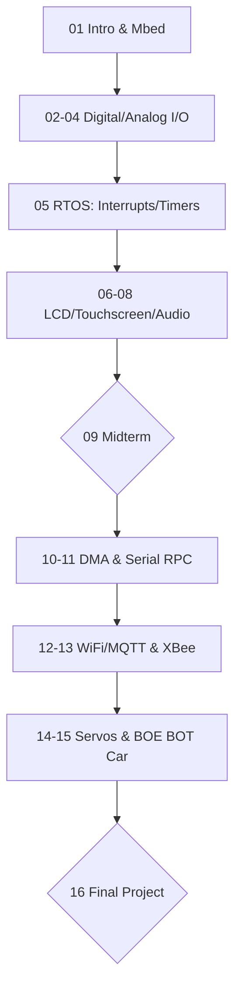

---
tags:
  - 嵌入式系統
  - 微控制器
  - IoT
  - Mbed
  - Cpp
aliases:
  - EE240500
  - 微控制器程式設計與應用
  - Embedded Systems Lab
date: 2026-03-30
---

# 嵌入式系統實驗 (Embedded Systems Lab)

> [!abstract] 課程簡述
> 本課程專注於**微控制器 (Micro-controller)** 的程式設計與應用。使用 **ARM mbed** 函式庫與 **C/C++** 語言，在 **Cortex M4** 開發板上實作。課程涵蓋感測器、致動器、有線/無線通訊，最終目標是整合所有組件打造一台 **Boe Bot 機器小車**。

---

## 核心技術棧
*   **硬體平台**：ARM Cortex M4 Board (Boe Bot Car Platform)
*   **軟體環境**：ARM mbed OS / RTOS
*   **通訊協定**：UART, SPI, I2C, Serial RPC, MQTT (WiFi), XBee (Zigbee), BLE
*   **週邊控制**：GPIO, ADC, DAC, PWM (Servo), LCD, PING (Ultrasonic), DMA

---

## 教學進度與 Lab 規劃

---

## 考核方式

> [!info] 成績比重 (Evaluation)
> - **Labs & Helper Work**：14% (13% Labs + 1% Helper)
> - **Exams**：48% (共 3 次，每次 16%)
> - **Final Project**：30% (機器小車整合與展示)
> - **Participation**：8% (課堂參與與貢獻)

---

## 資源連結
*   **課程網站**：[LARC NTHU EE2405](http://www.larc-nthu.net//ee240500/)
*   **教科書**：*Fast and Effective Embedded Systems Design: Applying the ARM mbed* (2nd Ed)
*   **參考書**：*Embedded System Interfacing* by Marilyn Wolf (2019)

---
**相關連結：**
- [[數位邏輯設計]]
- [[微處理器原理]]
- [[物聯網導論]]
- [[C語言程式設計]]
