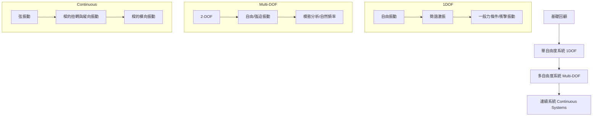

---
tags:
  - 機械振動
  - 動態分析
  - 工程學
aliases:
  - PME 3320
  - 機械振動
  - Mechanical Vibrations
date: 2026-03-30
---

# 機械振動 (Mechanical Vibrations)

> [!info] 課程基本資訊
> - **課程代碼**：PME 3320
> - **授課教師**：李明晃 (Ming-Huang Li)
> - **關鍵字**：#Vibration #Damping #1DOF #Multi-DOF #Continuous-System

---

## 課程目標與先修

> [!abstract] 課程目標
> 旨在建立大學部學生對動態振動分析的基礎概念，涵蓋單自由度、多自由度系統的數學描述，以及桿件、樑等連續系統的振動分析。

> [!tip] 先修建議 (Prerequisites)
> 本課程強烈建議具備以下基礎：
> - [[動力學]] (Dynamics)
> - [[材料力學]] (Mechanics of Materials)
> - [[工程數學]] (Engineering Mathematics)

---

## 課程大綱 (Course Outline)

---

## 評分標準與規定

### 成績考核 (Grading)
- **作業與小考** (含電腦輔助作業)：30%
- **期中與期末考**：55%
- **動手實作與學期專題**：15%

### 注意事項 (Leave Policy)
> [!warning] 缺考與請假規定
> 1. 無正當理由缺考（含小考、期中、期末）**不予補考**或以其他分數替代。
> 2. **心理因素**不得作為期中與期末考之請假理由。

---

## 教學資源
- **指定用書**：
    - Singiresu S. Rao, *Mechanical Vibrations*, 6th Edition (SI Units), Pearson.
    - ISBN: 9781292178608

---
**相關連結：**
- [[動力學]]
- [[材料力學]]
- [[機動學]]
- [[自動控制]]
