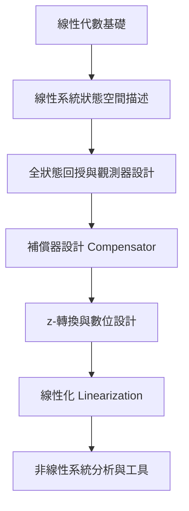

---
tags:
  - 控制系統
  - 自動控制
  - 狀態空間
  - 數位控制
aliases:
  - Control Systems II
  - 進階自動控制
date: 2026-03-30
---

# 控制系統 (二) (Control Systems II)

> [!abstract] 課程簡述
> 本課程為 [[控制系統(一)]] 的進階延伸，重點在於**狀態空間設計 (State-space Design)**、**數位控制 (Digital Control)** 以及 **非線性系統 (Nonlinear Systems)**。
> 
> *   **狀態空間**：從線性代數基礎出發，涵蓋全狀態回授、觀測器 (Estimator) 與動態補償器設計。
> *   **數位控制**：引入 z-轉換，學習數位等效控制器設計。
> *   **非線性系統**：介紹線性化與基礎非線性分析工具。

---

## 學習地圖 (Syllabus)

---

## 教學資源與先修

> [!info] 先修建議 (Prerequisites)
> - [[工程數學]]
> - [[控制系統(一)]]

> [!book] 指定用書 (Textbook)
> - **Franklin, G. F., et al. (2015)**. *Feedback Control of Dynamic Systems*, 7th Ed, Prentice Hall.

> [!cite] 參考書籍 (References)
> 1. Golnaraghi & Kuo. *Automatic Control Systems*, 9th Ed.
> 2. Norman S. Nise. *Control Systems Engineering*, 6th Ed.

---

## 考核方式

| 項目 | 比重 |
| :--- | :--- |
| **作業 (Homework)** | 30% |
| **期中考 (Midterms)** | 30% |
| **期末考 (Final Exam)** | 30% |
| **實驗作業 (Lab Assignments)** | 10% |

---
**相關連結：**
- [[控制系統(一)]]
- [[工程數學]]
- [[動態系統建模]]
- [[機器人學]]
