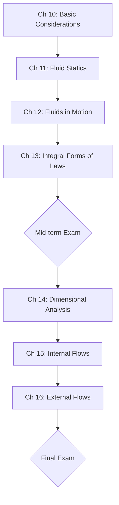

---
tags:
  - 熱流科學
  - 流體力學
  - 工程學
aliases:
  - Thermal and Fluid Science II
  - 流體力學基礎
date: 2026-03-30
---

# 熱流科學 (二) (Thermal and Fluid Science II)

> [!abstract] 課程簡述
> 本課程為熱流科學系列（I & II）的第二部分，重點在於**流體力學 (Fluid Mechanics)**。
> 
> *   **授課語言**：陳玉彬教授之課程主要以英文授課 (> 60%)。
> *   **核心關鍵字**：#流體力學、#層流、#紊流、#邊界層、#壓力。

---

## 課程進度 (Syllabus)

---

## 教學資源

> [!book] 指定用書 (Textbook)
> *   **Potter, M. C. & Scott, E. P. (2004)**. *Thermal Sciences: An Introduction to Thermodynamics, Fluid Mechanics and Heat Transfer*.

> [!cite] 參考書籍 (References)
> 1. Truns, S.R. (2006). *Thermal-Fluid Science*.
> 2. Cengel, Y.A., et al. (2012). *Fundamentals of Thermal-Fluid Sciences* (4th ed.).

---

## 考核方式

> [!info] 成績比重 (Evaluation)
> - **小考 (Quizzes)**：30% (預計 5 次)
> - **期中考 (Midterm Exam)**：35%
> - **期末考 (Final Exam)**：35%
> 
> **教學方式**：課堂講授 (Lectures) 與 筆試 (Written Exams)。

---
**相關連結：**
- [[熱流科學(一)]]
- [[工程數學]]
- [[熱力學]]
- [[熱傳學]]
