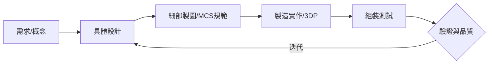

---
tags:
  - 機械設計
  - CAD
  - 工程開發
  - 實務課程
aliases:
  - Practical ME CADD
  - 機械設計製圖實作
date: 2026-03-30
---

# 機械設計製圖實作 (Practical ME CADD)

> [!abstract] 課程簡述
> 本課程為 [[工程圖學]] 與 [[機械設計製圖]] 的進階延伸。以**專案導向 (Project-oriented)** 為核心，系統化連結設備開發基礎訓練與團隊研發實務。透過導入機械零組件的設計、製造、組裝、測試與品質控管，讓學生在進階 CAD 軟體應用中，理解設計與製造間的關聯性。

---

## 核心教學單元

課程由七大主題單元組成，平均每單元分配兩週進度：

### 1. 專案開發與工藝技術
* **設計製圖專案技術**：建立從需求分析到工程開發的系統化流程。
* **零組件設計工藝**：將製圖結果與製造、組裝、測試及品質（Quality）深度連結，確保圖面「實際可行」。

### 2. 進階 CAD 軟體工具模組
* **模組化訓練**：除了基礎草圖與零件，導入業界實務模組：
  * 板金 (Sheet Metal)
  * 焊接 (Welding)
  * 框架與管路 (Frame & Piping)
  * 機械設計便覽應用

### 3. 機構設計與出圖規範
* **基礎技藝**：為未來的 [[機動學]] 與 [[機械設計]] 扎根。
* **工程出圖技術**：遵循 **MCS 機械製圖標準**，對齊業界正式出圖水準，強調標註規範與圖面溝通。

### 4. 製造連結與實作
* **加法製造 (3DP)**：以 3D 列印為主軸，訓練學員從設計直接進入實體製造、組裝與運轉測試。
* **減法製造**：兼顧傳統車、銑、鉋、搪、磨製程的概念應用。

---

## 課程流程規劃

---

## 考核方式

> [!info] 成績比重
> - **平時成績 (30%)**：課堂練習、創作訓練與課後作業。
> - **期中檢定 (20%)**：評量對 CAD 軟體應用與概念解析的熟練度。
> - **期末專題 (50%)**：整合七大單元，產出實作作品並透過實際運轉測試驗證。

## 學習資源
* **指定用書**：單元主題紙本簡報講義（鼓勵學員自行記載個人心得筆記）。
* **數位系統**：同步增補各單元教學內容。

---
**相關連結：**
- [[工程圖學]]
- [[機械設計製圖]]
- [[3D列印實務]]
